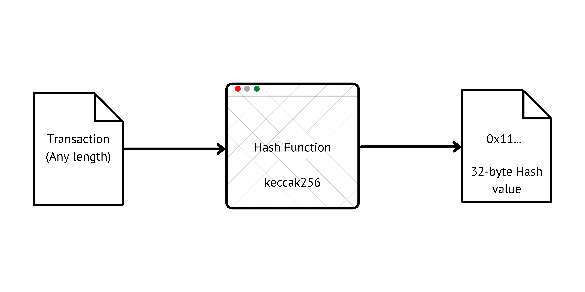
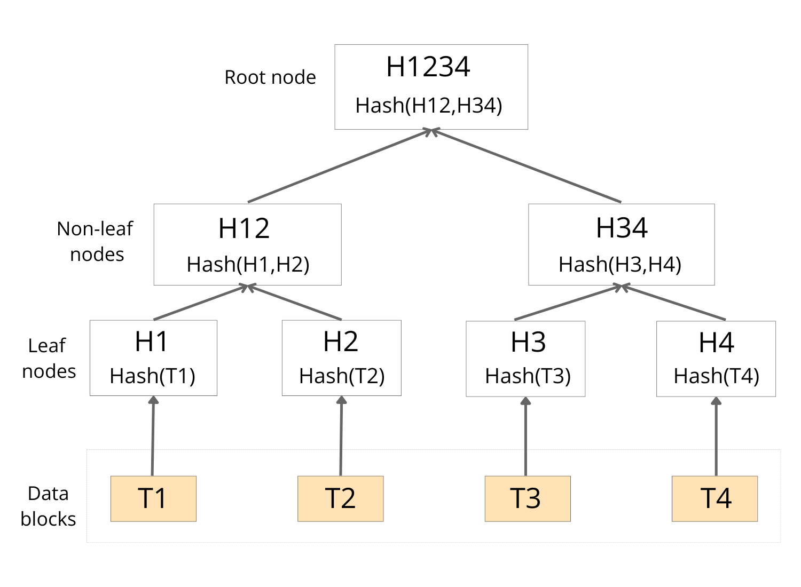
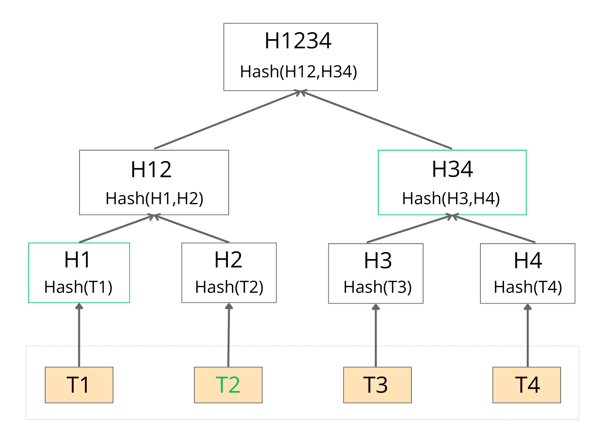

# Merkle Proofs explained


With the increasing adoption of blockchain technology, Merkle proofs have become crucial for ensuring data integrity and efficiency. They provide a reliable method for verifying the presence of data within a larger dataset. Each piece of data is hashed, and these hashes are organized in a hierarchical data structure called Merkle tree. By comparing hashes along a path from the data to the root, one can verify the authenticity of specific data. 


Without Merkle proofs, the verification would require downloading the entire blockchain because blockchain architectures store all transaction data in linear order, and to verify a single transaction, one would need to validate every block and transaction that came before it.


If you’re new to Web3, these terms might seem unfamiliar and confusing, but fear not— this article is tailored for you. Let's delve into Merkle proofs, Merkle trees and their application in the whitelisting process.


## Content

- [Hash Function](#HashFunction)
- [Merkle tree](#Merkletree)
- [Merkle proofs](#Merkleproofs)
- [Implementing Merkle proofs to whitelist email addresses](#ImplementingMerkleproofstowhitelistemailaddresses)


## Hash Function in blockchain 
Before getting into Merkle proof and Merkle tree, let’s understand what a hash function is. A hash function is a mathematical function that takes an input string of any length and converts it to a fixed-length output string called a hash value. In blockchain, the  transactions are taken as inputs and the hash algorithm gives an output of a fixed size. 

The size of hash value can vary depending on the hash function used. For example, hash function ```Keccak-256``` generates a 32 byte hash value. If there are an odd number of leaf nodes, the last leaf is duplicated and the same hash value is used until there are enough intermediate nodes to maintain balance in the tree structure.

Hash functions are used in Merkle Proofs to hash all the transactions in a data block and further create a Merkle tree by hashing all pairs of nodes until the top of the tree is reached. The concept of Merkle trees and proofs is based on Hashing. 



## Merkle Tree
A Merkle tree, named after Ralph Merkle, is a binary structure tree of hash values. It acts as a summary of all the transactions in a block, enabling fast and secure verification of data across larger datasets. In Merkle tree, the last node of the tree called the leaf is a hash of transaction data, the intermediate node is referred to as the non-leaf node is a hash of its children, and the hash at the top is referred to as the root. 


All leaves are grouped in pairs in the Merkle tree structure. Each pair has a computed hash that is stored directly in the parent node. These nodes are then grouped into pairs, and their hash is stored on the next level up. This process continues until reaching the top of the Merkle tree.


For example, consider the Merkle tree with four transactions- T1, T2, T3, and T4. These transactional data will be hashed before being stored as a leaf node resulting in H1- Hash of T1, H2- Hash of T2, and so on for H3 and H4.  Now consecutive pairs of leaf nodes will be hashed to create a parent node. Hashing H1 and H2 will result in H12, similarly hashing H3 and H4 will result in H34. Lastly, H12 and H34 are then hashed to create root hash H1234.





## Merkle Proofs
A Merkle Proof, also known as a Merkle Authentication Path is a path from the leaf all the way up to the root along with the necessary sibling node required for the hash value of parent node. It is a method to prove that a specific piece of data is a part of Merkle tree, without needing access to the entire Merkle tree.


For example, let’s use the above Merkle tree and create a Merkle proof for data T2. 
To generate a Merkle proof for data T2, we will traverse the tree from the leaf node containing the hash of data T2 up to the root node and collect the hash values of the sibling nodes encountered during the traversal. These sibling hashes constitute the Merkle proof for data T2.



To verify the Merkle proof for data T2, start with the hash of data T2 and use the collected sibling hashes to recreate the path up to the root node. Then compare the resulting root hash with the known root hash of the Merkle tree. The root calculated is the same as the provided root, so the data T2 is indeed a part of Merkle tree. 


## Implementing Merkle Proofs to whitelist Email addresses

Now, let’s see how Merkle Proofs can be utilized for whitelisting email addresses, ensuring data integrity and security. For this tutorial, we will use Javascript and ```merkletreejs``` library to create a Merkle tree and ```keccak256``` to hash the data. 
To follow along with the tutorial, you can either clone the repository and run node index.js in your terminal or follow the instructions below to create your own Merkle tree to whitelist email addresses.
Getting started

### Install merkletreejs and keccak256:

Make sure you have Node.js installed on your system. You can download and install it from the official Node.js website.
After installing Node.js, navigate to your project directory in the terminal and run the following command to install merkletreejs:

From [npm](https://www.npmjs.com/package/merkletreejs):

```bash
npm install merkletreejs
npm install keccak256
```

Import as CommonJs in ```index.js``` file:
```js
const { MerkleTree } = require('merkletreejs')
const keccak256 = require("keccak256");

```

### Creating a list of Email addresses: 

 ```js
//list of email addresses to whitelist
let emailAddresses = [
   "test1@gmail.com",
   "test2@gmail.com",
   "test3@gmail.com",
];

```
### Hash the data:
We will use ```keccak256```, an in-built for computing hash values.
```js

//hash email addresses (data) to get the leaves of Merkle tree
let leaves = emailAddresses.map(email => keccak256(email));
```

### Creating Merkle tree:
Create a Merkle tree with ```merkleTree``` class using ```leaves```, ```keccak256``` to hash the values provided in the leaves and sort the leaf nodes if specified. 
```js
// create Merkle Tree
let merkleTree = new MerkleTree(leaves, keccak256, { sortPairs: true });

// get root hash
let rootHash = merkleTree.getRoot().toString('hex');

// We can print the Merkle tree structure:
console.log(merkleTree.toString());
```
Output: This is what the Merkle tree structure looks like. Since there is an odd number of leaves, the last leaf is duplicated. 
```bash
└─ bf7addb5243da37965dbccb6ed456ceb55b81aa7e5ab2a41379b1742fdf222f0
   ├─ ec0b79751b4a12ce50fe71b6fa7b1583df0a1fa676827d0a7030a1170ca1c032
   │  ├─ 231e1a4d644b6760a8d51cae313e8a78c35e4783bfaf5225712734939387d148
   │  └─ 8de86150eaaafcb9367396f2bee0cfd657854c6c561b741f6f8ef4fb28e82e12
   └─ 2746415648413ade4abc137894b0fa189d921433053a910c955568a6265c00e6
      └─ 2746415648413ade4abc137894b0fa189d921433053a910c955568a6265c00e6
```

### Emails to be whitelisted:
Let's whitelist the following Email addresses, feel free to change the data for different test cases. 
```js
let valuesToCheck = [
    "test1@gmail.com",
    "test2@gmail.com",
    "test3@gmail.com",
];
```

### Whitelisting Emails with Merkle proof:
Iterate over all the values in ```valuesToCheck``` list, hash it using the ```keccak256``` function. <br>
Now using the hash value, retrieve the Merkle proof- consisting of sibling nodes along the path from the leaf node to the root node.  <br>
The ```verify``` method will ensure that the provided Merkle proof, when combined with the hashed email, leads to the calculated root hash and returns ```true```, otherwise false. 
```js
valuesToCheck.forEach( (value => {
    let hashedEmail = keccak256(value);
    let proof = merkleTree.getHexProof(hashedEmail);
    let isWhitelisted = merkleTree.verify(proof, hashedEmail, rootHash);
    console.log(isWhitelisted); // returns true or false
}) );
```

### Testing:
Since the Email addresses (data) in ```valuesToCheck``` are included in the Merkle tree, the output will be true. 
```bash
true
true
true
```
Let's change the data and check if they are whitelisted or not.
```js
let valuesToCheck = [
    "test1@gmail.com",
    "test2@gmail.com",
    "test3@gmail.com",
    "test4@gmail.com",
    "not whitelisted",
];
```
The first three emails are included int the Merkle tree but the rest of the datasets are not. You can try changing the first dataset created to  : 
```
true
true
true
false
false
```

Let's also print the Merkle proof path for each value to see how it is traversed during verification. 

```js
//Merkle proof of each value
console.log(proof);

//Output: 
[
  '0x8de86150eaaafcb9367396f2bee0cfd657854c6c561b741f6f8ef4fb28e82e12',
  '0x2746415648413ade4abc137894b0fa189d921433053a910c955568a6265c00e6'
]
[
  '0x231e1a4d644b6760a8d51cae313e8a78c35e4783bfaf5225712734939387d148',
  '0x2746415648413ade4abc137894b0fa189d921433053a910c955568a6265c00e6'
]
[
  '0xec0b79751b4a12ce50fe71b6fa7b1583df0a1fa676827d0a7030a1170ca1c032'
]
```

I hope you enjoyed the tutorial and gained a better understanding of Merkle Proofs. They play a crucial role in ensuring data integrity and security, especially in blockchain systems like Bitcoin and Ethereum. As datasets grow, managing Merkle trees becomes more complex, but their efficiency in verifying large amounts of data remains unparalleled. Keep exploring and experimenting with Merkle Proofs, as they continue to evolve and find new applications in different fields.

Happy coding!
